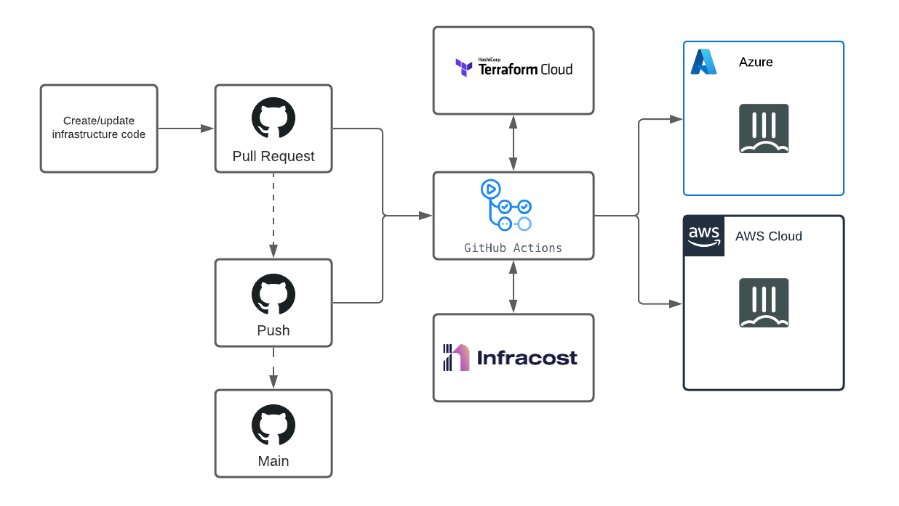
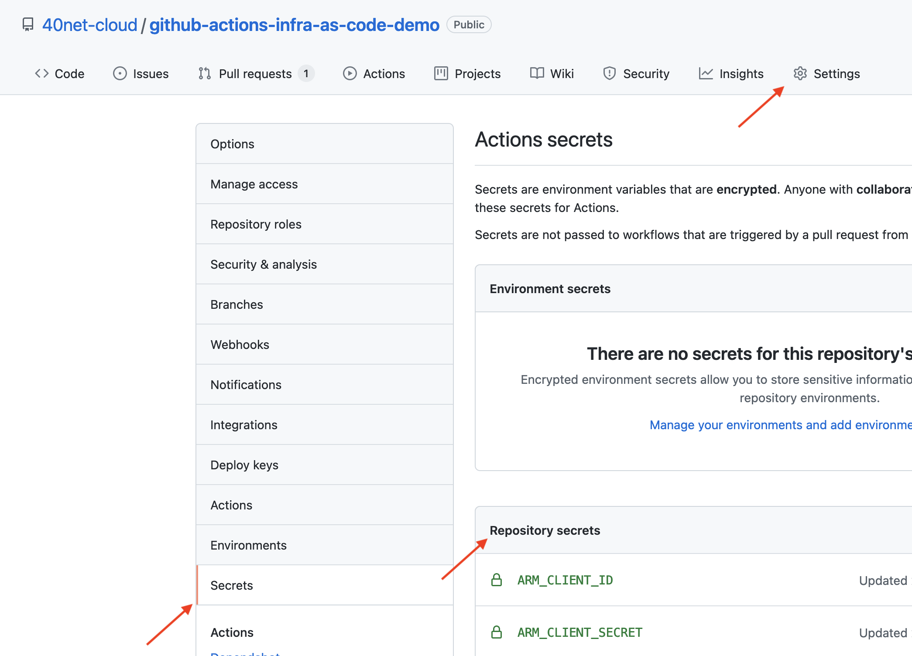

# Infrastructure As Code demo for FortiGate using GitHub Actions, Terraform Cloud and Infracost.

## Introduction

Infrastructure as code (IaC) is the process of managing and provisioning of your computer systems using machine readable files, similar to the process of writing software. Over the years many tools have emerged on the market that can used to achieve this process. In this demo we are leveraging several of these tools to create a demo to deploy an infrastructure into public cloud and securing this environment with FortiGate.

## Design

Everything starts with a commit of new or updated code into GitHub. This starts of a verification and deployment phase. Before deployment the validation of the Terraform files is performed as well as plan that indicates the proposed creation, deletion and updating of resources in the different public cloud environments managed by this pipeline.

- FortiGate terraform files
- GitHub and GitHub Actions: All code is stored is a GitHub repository and the automation including deployment is performed by GitHub Actions.
- Terraform Cloud: We leverage Terraform Cloud to store the state file Terraform uses.
- Infracost: Is a tool that leverages the Terraform plan file to provide an estimate on the cost of running the infrastructure in Public Cloud. With any updates on the infrastructure a cost change compared to the previous deployment is performed and reported.

Code can be submitted via a pull request and needs to pass the different validations steps before the code can be merged into the main development tree.

## Deployment

This repository can be forked to start a new IaC journey.

- Create a Terraform Cloud account [here](https://www.terraform.io/cloud) and [create a new user API token](https://www.terraform.io/docs/cloud/users-teams-organizations/users.html#api-tokens)
- Create an API key for Infracost [here](https://www.infracost.io/docs/)
- Create a [Azure Service Principal](https://docs.microsoft.com/en-us/cli/azure/create-an-azure-service-principal-azure-cli) and assign it the required rights to deploy the infrastructure. In this setup Terraform is using the Service Principal with a client secret as explained [here](https://registry.terraform.io/providers/hashicorp/azurerm/latest/docs)
- Create an [AWS access key and secret](https://registry.terraform.io/providers/hashicorp/aws/latest/docs) to deploy into the AWS environement.
- Create or upload a keypair for the deployment region in AWS.

The resulting secrets as well as a password to be used for the main accounts of the FortiGate deployment need to be added as repository secrets into the settings of the GitHub repository.

Azure:
- ARM_CLIENT_ID
- ARM_CLIENT_SECRET
- ARM_SUBSCRIPTION_ID
- ARM_TENANT_ID

AWS:
- AWS_ACCESS_KEY
- AWS_SECRET_KEY
- AWS_KEY_PAIR

Infracost:
- INFRACOST_API_KEY

Terraform Cloud:
- TF_API_TOKEN

Password:
- PASSWORD

## Support

Fortinet-provided scripts in this and other GitHub projects do not fall under the regular Fortinet technical support scope and are not supported by FortiCare Support Services.
For direct issues, please refer to the [Issues](https://github.com/40net-cloud/fortinet-azure-solutions/issues) tab of this GitHub project.

## License

[License](LICENSE) © Fortinet Technologies. All rights reserved.